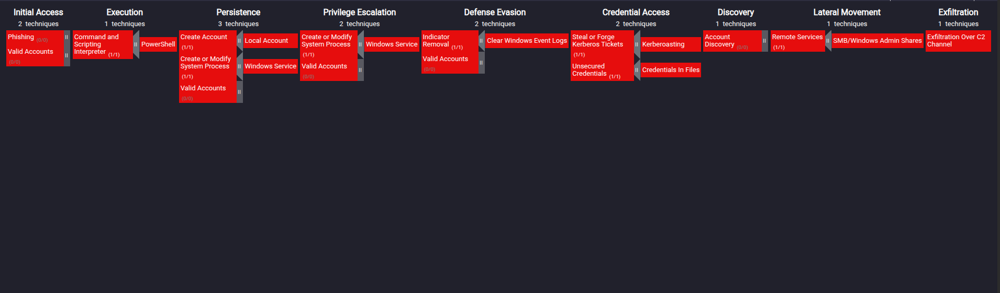

# MITRE ATT&CK Framework Mapping

## Detected Techniques Summary

**Initial Access** - T1566 - Phishing

**Execution** - T1059.001 - PowerShell Scripting

**Persistence** - T1543.003 / T1136.001 - Windows service and local account creation

**Defense Evasion** - T1070.001 - Clearing Windows Event logs

**Credential Access** - T1558.003 - Kerberoasting (RC4 Ticket Requests)

**Lateral Movement** - T1021.002 - SMB/Windows Admin Shares

**Exfiltration** - T1041 - Exfiltration Over C2 Channel

MITRE ATT&CK Matrix:

