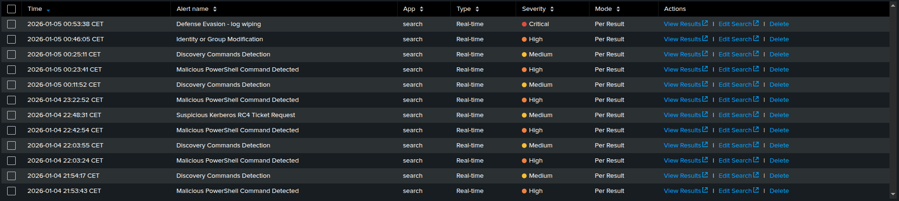

# Investigation Overview

## 1. Initial Alert Triage

### Triggered Alerts
I started the investigation after multiple high and medium severity alerts were triggered within a short time window:

Despite Having a preconfigured SOC Dashboard, I noticed that it was misconfigured and didn't provide a clear correlation of the unfolding attack. To ensure full visibility i shifted to manual SPL hunting.

### Initial High-Confidence indicators:
 - Malicious PowerShell Command Detected
 - Discovery Commands Detection
 - Suspicious Kerberos RC4 Ticket Request

## 2. Alert Validation - Malicious PowerShell Execution

### Analyst Action

First alert that i analyzed was "Malicious PowerShell Command Detected", as it represented the earliest high-cofidence indicator of compromise.

I reviewed Sysmon Event ID 1 logs and found powershell.exe launched with a large -EncodedCommand block.
Then i used CyberChef to decode the base64 string, which revealed a TCP reverse shell targeting 192.168.33.33:4444
This Confirmed an active C2 channel which meant that the alert is True Positive.

## 3. Post-Exploitation Discovery and Failed Escalation

After establishing C2, the attacker began internal reconnaissance.

### Analyst Action

I searched for common discovery tools (whoami, net user, ipconfig, etc.) and also checked Suspicious Kerberos RC4 Ticket Request alert SPL, i've noticed that attacker tried to use sql_svc account to add m.victim account
to local administrators group but his escalation attempt failed due to Access Control restrictions(Verified by checking for a lack of Event ID 4732). But then i saw that "soclab\administrator" created new account "svc_backup" and
added it to domain admins group.

## 4. Credential Theft

Seeing that administrator created new user shortly after an incident start i suspected that as malicious activity so i filtered logs for time between failed escalation attemtps and creation of new user and started to search manually through logs
Then i found that "notepad.exe" was used to open "passwords.txt"  on m.victim desktop, which meant that attacker obtained plaintext password for soclab\administrator account.

## 5. Lateral Movement and Administrative Pivot

Immediately after credential theft i started to look for Administrator account activity and i saw that attacker used "net use" to map Domain Controller's C$ share.

## 6. Identifying Persistence and Exfiltration

Then after searching further through logs i've seen that administrator account created WinCryptoMiner service and executed powershell Invoke-WebRequest posting finance_leak.zip to C2 server.

## 7. Defense Evasion - Log wiping

Critical alert triggered for event ID 1102 confirmed attacker's intent to evade forensic analysis, but logs were streamed in real-time to Splunk so all evidence was preserved for investigation.
