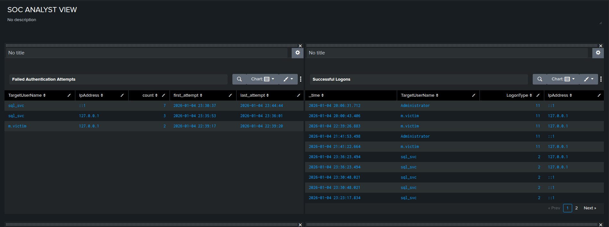
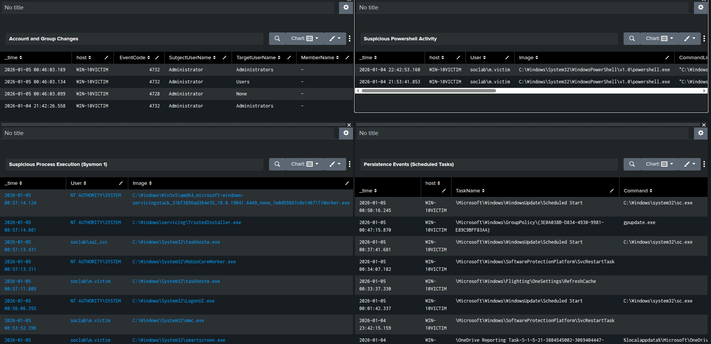
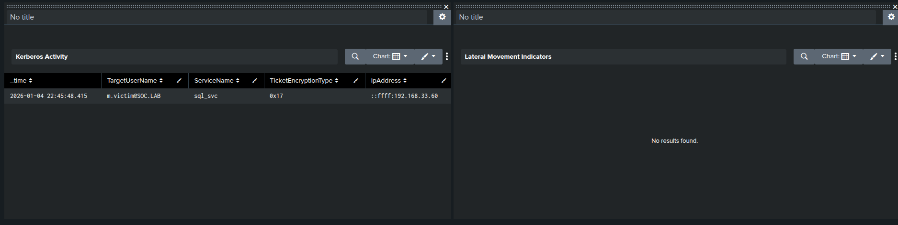

# Active Directory SOC Detection Lab

##  Table of Contents
### [1. Overview](#overview)
### [2. Lab Architecture](#lab-architecture)
### [3. Detection Engineering and Analytics](./Analytics)
* [Custom Splunk Alerts](./Analytics/alerts.md)
* [SOC Monitoring Dashboard](./Analytics/dashboard.md)
* [MITRE ATT&CK Mapping](./Analytics/mitre_mapping.md)
### [4. Incident Response Documentation](./Incident_Response/)
* [Incident Summary](./Incident_Response/incident_summary.md)
* [Full Attack Timeline](./Incident_Response/attack_timeline.md)
* [Investigation and Evidence](./Incident_Response/investigation.md)
* [Containment and Eradication](./Incident_Response/containment_and_eradication.md)
* [Lessons Learned and Hardening](./Incident_Response/lessons_learned.md)
### [5. Infrastructure and Provisioning](#repository-structure)
* [AD Setup Script](./Provisioning/AD_provisioning.ps1)
* [Telemetry Configuration](./Telemetry/)

## Overview

This project simulates a real-world security incident in a Windows Active Directory environment from a SOC Analyst perspective.

The scenario focuses on detection, investigation, and incident response to a phishing-based attack that resulted in:
- Initial user compromise
- Malicious PowerShell execution
- Command and Control communication
- Credential abuse and privilege escalation
- Persistence mechanisms
- Data exfiltration
- Log tampering for defense evasion

All activity was centrally logged and analyzed using Splunk, allowing full reconstruction of the attack timeline and evaluation of detection coverage.

## Lab Architecture

The lab environment was designed to be similar to a small enterprise Active Directory setup monitored by a centralized SIEM.

- **Domain Controller:** Windows Server 2022 VM
- **Workstation** Windows 10 VM (initially compromised via phishing)
- **Attacker Machine:** Kali Linux VM
- **SIEM:** Splunk Enterprise running on the host machine
- **Log forwarding:** Splunk Universal Forwarder
- **Telemetry**:
    -  Windows Security Event Logs
    -   Sysmon
- **Networking:** Virtual machines were connected using Bridged networking, allowing them to communicate directly with each other and the host machine.

## Detection Strategy
Before the attack simulation, I configured detection logic and alerts to simulate proactive SOC environment.

The detection Strategy focused on:
- Authentication abuse
- Suspicious PowerShell activity
- Suspicious Process Execution
- Persistence mechanisms
- Log tampering

## SOC Dashboard

This dashboard was created before the attack and was supposed to serve as the primary monitoring interface during the incident, but it was a little bit misconfigured so i couldn't rely only on it.

## Incident Summary

The incident began with a phishing attack targeting a workstation user (m.victim).
After the user executed a malicious PowerShell script, the attacker established a reverse shell connection to the compromised host.

Then the attacker actions included:
- Post-compromise discovery
- Credential abuse
- Privilege escalation
- creation of persistence mechanisms
- Data exfiltration via HTTP requests
- Log wiping

Some of the preconfigured alerts were triggered, allowing detection and retrospective analysis of the full attack chain.

## Incident Response Scope

This project focuses on the analyst-side incident response process including:
- Alert validation and triage
- Investigation and timeline reconstruction
- Identification of affected users
- Assessment of attacker objectives and impact
- Recommended containment, erication, and recovery actions

## Repository Structure
- **Telemetry/** - Log collection configuration (Sysmon, Splunk inputs)
- **Provisioning/** - Script used to provision lab users
- **Analytics/** - Dashboard and detection logic
- **Incident_Response/** - Incident analysis, timeline, and response documentation
- **images/** - Screenshots related to the project
